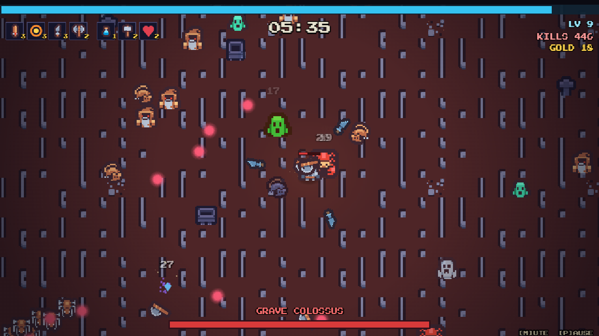
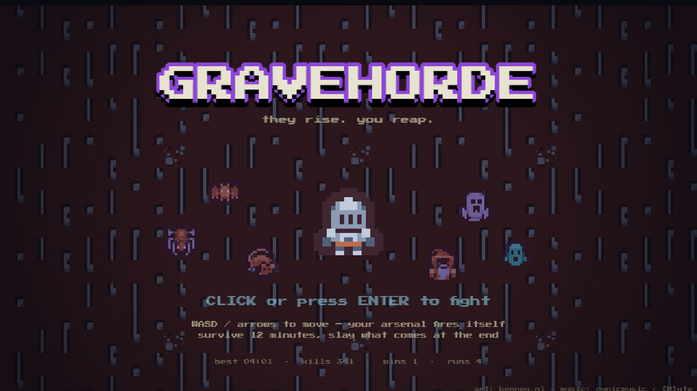

# AI EVOLUTION GAME · 精灵进化实验

> 用可验证的规则约束 AI 创意，让每次进化真正改变下一场战斗。

A browser action-game POC for testing constrained, AI-assisted creature evolution. The player
starts in a base form, evolves after the first wave, and validates the chosen route in combat.

**▶ GitHub Pages（仓库启用 Pages 后）：https://wubaijian.github.io/ai-evolution-game/**

Built with Phaser 3 + TypeScript + Vite, based on the MIT-licensed GRAVEHORDE prototype.



<details>
<summary>title screen</summary>


</details>

## How to play

| | |
| --- | --- |
| Move | **WASD** or arrow keys |
| Aim | Mouse |
| Basic attack | **Left mouse** / **J** |
| Core skill | **Right mouse** / **K** |
| Dodge | **Space** / **Shift** |
| Choose upgrades | **1/2/3**, arrows + Enter, or click |
| Pause | **P** / Esc |
| Mute | **M** |

Kill enemies → collect the gems they drop → level up → pick one of three boons.
Each wave lasts **25 seconds**. At **1:15**, the arena is cleared and the two-phase Trial
Warden arrives. Reduce it below half health to trigger its faster spiral-barrage phase.

Every run begins with the same base creature. After surviving the first 25-second wave, choose
one of three fixed evolution prototypes loaded from `src/data/evolutions.json`:
**Stormwing Archer**, **Burrow Hunter**, or **Tidal Shaman**.
Each choice has its own movement form, primary attack, core skill, survival action, terrain
interaction, health and cooldown tuning.
Every definition is checked against deterministic constraints from
`src/data/evolution-rules.json` before it can enter combat.

The evolution screen also accepts a player-written creature idea. The local server asks the
configured default text model for three structured flavor interpretations—name, tagline, story
hook and future visual direction—one for each legal route. AI output never controls stats or
ability costs. Without a working model connection, or on a static host, the same screen returns
deterministic local ideas instead of blocking play.

### Evolution combat prototypes

- **Stormwing Archer** — permanent flight, ranged bolts, multi-target lightning chain,
  and a long air dash. Ordinary ground creatures cannot deal contact damage while it flies.
- **Burrow Hunter** — short-range claw attacks, timed underground movement, empowered
  emergence, and a high-damage eruption. It cannot attack while underground.
- **Tidal Shaman** — splash projectiles, a slowing damage vortex, and liquid sliding.
  Entering a blue tidal pool grants faster movement, damage reduction, a larger vortex,
  and a stronger slide.

The following legacy weapon data remains in the project as source material, but these weapons
are no longer offered by the current level-up pool:

- **Grave Spark** — arcane bolts at the nearest foe (starter)
- **Reaper's Arc** — sweeping melee arcs with heavy knockback
- **Bone Axes** — lobbed axes that arc overhead and pierce
- **Spirit Blades** — daggers orbiting you
- **Unholy Nova** — radial pulses of grave-fire
- **Stormcall** — lightning on random visible enemies

### Passives (max 4)

Power, cooldown, max HP, move speed, pickup range, armor, regen, and +1 projectile.

### The bestiary

Gravewings, Plague Rats, Grave Oozes, Crypt Spiders, knockback-immune Wraiths,
ranged Grave Acolytes and tanky Tomb Crawlers appear in three readable pressure tests.
The **Trial Warden** closes the run with an aimed-volley phase and a faster spiral phase.

## Dev

```bash
npm install
npm run dev        # local dev server
npm run build      # typecheck + production build → dist/
npm run typecheck  # tsc --noEmit only
```

Local multi-model AI gateway:

```bash
npm run gateway:setup  # first run only
npm run gateway:start  # keep this terminal open
npm run dev            # run in another terminal
```

Open `http://127.0.0.1:5173/developer/`, choose **模型提供商**, and paste an API key.
The console identifies OpenAI, Anthropic, Gemini, DeepSeek, Volcengine Ark, or OpenRouter from the key or optional
API address; ambiguous `sk-` keys pause for a provider confirmation before any verification
request is sent. Ollama and custom OpenAI-compatible endpoints can be entered through the optional
API address field. Each provider credential is configured once. The page verifies the account, fetches its model
catalog, and exposes a switch for adding individual models to the shared model pool. Agent
editors read their model options directly from that pool instead of maintaining a separate,
hard-coded model list.
Volcengine Ark credentials are checked against its `/ping` endpoint. Because Ark does not use the
same account model-discovery flow as standard `/models` providers, add its model ID or deployed
Endpoint ID with the provider card's **添加模型** action.
Use **默认模型设置** to choose the primary model and order any backups. LiteLLM will try those
backups in order when the primary request fails, times out, or is rate-limited.
Provider keys and generated LiteLLM configuration stay in ignored local files under
`developer-data/` and are never exposed through a `VITE_` browser variable. The current
GitHub Pages build is static, so it uses the deterministic local fallback until a production
server endpoint is selected.

The developer console currently provides local CRUD editors for Agents and Skills plus the model
provider/model-pool configuration. Agent execution, Skill invocation, image generation, debugging,
release management and rollback are planned work rather than finished runtime features.

Deploys to GitHub Pages automatically on push to `main` (see `.github/workflows/deploy.yml`).

## Architecture

```
src/
  config.ts            # every balance knob in one place
  data/                # weapons / passives / enemies / wave timeline (pure data)
    evolutions.json    # fixed three-choice evolution definitions and combat modifiers
    evolution-rules.json # stat budget, ability costs, exclusions, and rule limits
    evolution-flavor.ts # generated-copy contract, validation, and local fallback
  entities/            # Player, Enemy (data-driven brains), Projectile — all pooled
  systems/
    RunState.ts        # build, xp/levels, stat recompute, upgrade-choice pool
    Arsenal.ts         # creates manual attacks and maintains continuous weapon effects
    SpawnDirector.ts   # pressure curve, scripted events, spawn ring, leash recycling
    Loot.ts            # gems, magnet sweep, pickups, chests (no physics — distance checks)
    Juice.ts           # damage numbers, particles, ring pulses, slashes, lightning, shake
  services/
    EvolutionGeneration.ts # AI endpoint client with deterministic fallback
  scenes/              # Boot (asset gen+load), Title, Game, Hud, LevelUp, Pause, GameOver
```

Design notes:

- **Everything that spawns repeatedly is pooled** (enemies, projectiles, gems, damage text).
  Verified ~57 FPS with 180+ enemies, a boss, and full arsenal on screen.
- **One pausable run-clock** (`GameScene.runTime`) drives every cooldown/timer, so the
  level-up pause can't desync weapon timers or projectile lifespans.
- **Procedural where it glows**: projectile orbs, gems, slash arcs, lightning, vignette and
  icons are canvas/Graphics-generated at boot; only characters/tiles/audio are files.
- Enemy AI is data-driven from `data/enemies.ts`: chasers, drifters (wraiths), ranged
  kiters (acolytes), and per-boss brains in `Enemy.bossBrain`.

## Licensing

Code is MIT. The repository preserves the original GRAVEHORDE copyright notice and credits;
the constrained evolution system, manual combat changes and developer console are derivative
additions. All bundled assets are CC0 except the OFL pixel font — full breakdown with sources
and authors in [CREDITS.md](CREDITS.md).
